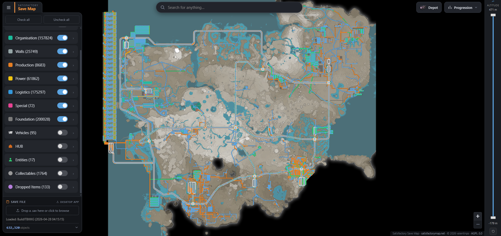
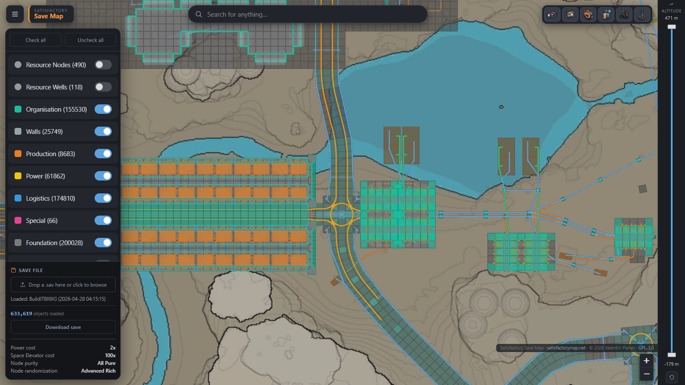

# Satisfactory Save Map

**Drop your save file, see your whole factory in seconds — right in the
browser, without uploading anything anywhere.**

**▶ [satisfactorymap.net](https://satisfactorymap.net/)** — no install, no
account. Or get the [desktop app](#desktop-app) for saves too big for any
browser.

Your save is parsed **on your own machine** by a Rust parser compiled to
WebAssembly. Nothing is uploaded, so there is nothing to wait for: a
**600,000-object endgame save loads in ~8 seconds** — the same save takes
almost two minutes on the incumbent web map, a measured **13× difference**
([methodology & reproducible script](docs/BENCHMARK.md)).

## What you get

- **The whole factory, mapped** — buildings by build-menu category,
  belts/pipes/railways/power lines as curves, resource nodes with purity,
  vehicles, trains, players, collectables and crash sites.
- **Find anything** — search across every inventory in the save ("where did
  I leave my hard drives?"), per-building tooltips with recipe, power,
  clock speed and belt/pipe **bottleneck detection**.
- **Progression at a glance** — MAM research, alternate recipes, AWESOME
  Shop, HUB milestones, Space Elevator status.
- **Select & total** — rectangle-select any part of the factory and get its
  combined inventory and object list.
- **Edit your save** — move, copy/paste, rotate or delete whole factory
  sections (with undo), then download the edited `.sav` and load it in the
  game.
- **Private by construction** — fully client-side; the save never leaves
  your machine. Works offline once loaded.

## Desktop app

Browsers cap WebAssembly at 4 GB of memory, which the very largest
mega-factory saves can exceed. The desktop app (Tauri, Windows) wraps the
same engine and the same interface with no memory ceiling — and it's the
fastest way to open saves straight from your save folder. Download the
installer from the
[Releases page](https://github.com/valentinps/satisfactorymap/releases),
or build it from source in a few minutes
(see [CONTRIBUTING.md](CONTRIBUTING.md#desktop-app-tauri)).

**Why does Windows warn when installing?** The installer is not
code-signed — signing certificates cost hundreds of euros per year, which
isn't sensible for a free tool yet. Windows shows its standard "unknown
publisher" SmartScreen prompt for any unsigned installer; "More info →
Run anyway" proceeds. The app is open source, the installer is built from
this repository, and every release lists SHA-256 checksums so you can
verify what you downloaded.

## Building from source

Everything — site, parser, desktop app, data extraction — is covered in
[CONTRIBUTING.md](CONTRIBUTING.md).

## Credits & save-format lineage

The Rust parser is a port of
[GreyHak/sat_sav_parse](https://github.com/GreyHak/sat_sav_parse), validated
field-by-field against the Python reference with bit-exact differential
gates. The static world tables in `game_data/sav_data/` were converted from
that project. This project wouldn't exist without GreyHak's format work.

## License & trademark

The code is licensed under [AGPL-3.0](LICENSE) — the parser port with
GreyHak's written permission, since the upstream it derives from is
GPL-3.0-only (scope recorded in [NOTICES.md](NOTICES.md)). The
**Satisfactory Save Map** name, logo, and the `satisfactorymap.net` domain
are *not* covered by that license: forks and rehosts are welcome under the
AGPL, but must use their own name and domain, must preserve the copyright
and license notices (including the in-app footer), and — being AGPL — must
publish their source, including when only serving the app. The canonical
instance is [satisfactorymap.net](https://satisfactorymap.net/).

Satisfactory is a trademark of Coffee Stain Studios. The game-derived data
(icons, map image, item/building tables) belongs to Coffee Stain Studios and
is not distributed in this repository — see
[CONTRIBUTING.md](CONTRIBUTING.md). This project is not affiliated with or
endorsed by Coffee Stain Studios.
